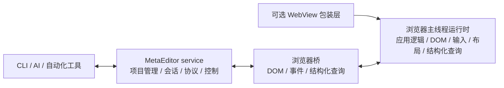

# MetaEditor 设计文档

MetaEditor 是一个基于 MoonBit 的编辑器开发框架（元编辑器）。系统主程序是 **`service`**：它就是 MetaEditor 本身，负责项目管理、页面会话、结构化 query / exec 协议，以及对浏览器运行时的控制。

## 1. 项目目标

- **响应式架构**：基于细粒度 Signal 机制组织状态与派生状态。
- **MetaEditor 主程序**：`service` 持续运行，负责项目管理、页面连接、结构化协议与测试调度。
- **浏览器主运行时**：浏览器主线程承载当前 app 逻辑、视图与宿主状态。
- **结构化 UI 查询**：AI/CLI 必须能稳定读取浏览器中的节点、几何、可见性、焦点等结构化结果。
- **自动化 UI 操作**：AI/CLI 必须能以结构化命令驱动真实 UI，而不是依赖截图或 OCR。
- **内置 app 测试**：`service` 直接执行当前 app 的结构化测试流程，测试不再以 JavaScript harness 为正式入口。
- **状态一致性**：应用状态更新统一走受控 op / patch / history 路径，避免直接散落式修改。

## 2. 运行模型

系统采用“**MetaEditor service + 浏览器主线程运行时 + 外部控制端**”模型：

- **MetaEditor service**：MoonBit native 常驻主程序；负责项目管理、会话管理、query / exec / action 协议、状态机，以及对浏览器页面的统一控制。
- **Browser Main Thread**：负责 DOM、输入事件、焦点、滚动、布局测量、视图采样，以及当前应用逻辑的执行。
- **CLI/AI/自动化工具**：通过结构化接口连接 `service`，发送 query / exec / action / test 命令，并读取结构化结果。
- **浏览器桥**：只负责浏览器宿主 API 适配、DOM 执行、结构化读取与事件回传。

### 2.1 连接原则

- 浏览器运行时和控制端之间采用排他性连接模型：同一时刻只允许一个主控制会话持有控制权。
- 额外控制连接默认拒绝，不做并发控制合并。
- 主控制连接断开后，原会话应允许自动重连。
- 重连不是“建立一个新身份”，而是恢复到原会话语义下继续控制。

### 2.2 会话原则

- 控制端连接应具有稳定的 `session_id` 或等价会话标识。
- `session_id` 表示控制会话身份，而不是抢占旧连接的凭证。
- 只有携带正确会话标识、且旧连接已经断开的重连，才能恢复原控制权。
- 同一时刻只允许一个活跃浏览器连接；双开页面默认拒绝，不允许同 `session_id` 抢占旧连接。
- 连接恢复后，系统必须执行一次明确的状态再同步，而不是假设本地缓存一定正确。
- 再同步至少覆盖：动作列表、UI 快照、连接状态。

### 2.3 当前握手协议

- 浏览器连接建立后首先发送 `bridge:hello`。
- `bridge:hello` 至少包含：
  - `role`
  - `session_id`
  - `user_agent`
- 服务端响应分为两类：
  - `bridge:hello_ack`：握手成功；若属于断线恢复，则标记为重连成功
  - `bridge:rejected`：握手失败；当前至少包含 `unsupported_role`、`missing_session_id`、`session_busy`
- 浏览器收到 `bridge:rejected` 后停止自动重连；收到 `bridge:hello_ack` 后进入已连接状态。



## 3. 真相模型

“真相”由 `service` 和浏览器运行时共同构成，不额外抽象一个脱离两者的第三真相层。

- **服务真相**：项目状态、页面会话、控制连接、query / exec / action 协议状态。
- **语义真相**：当前 app 状态、操作历史、派生状态、动作注册表。
- **宿主真相**：DOM 结构、布局结果、滚动、焦点、可见性等浏览器原生状态。
- **结构化真相**：对外暴露给 CLI/AI 的统一查询结果；由 `service` 汇总浏览器内结构化读取结果后对外提供。

核心原则是：**CLI/AI 看到的 UI 真相必须来自浏览器内部的结构化读取，而不是截图推断。**

## 4. 接口原则

### 4.1 Query

查询接口面向自动化而不是面向业务手写：

- 查询入口是统一的结构化协议，而不是应用层手动注册若干字符串 query。
- 查询结果应覆盖节点结构、文本、属性、焦点、视口、几何、可见性等通用 UI 信息。
- 应用若需要暴露额外语义信息，应优先把它编码进状态与 UI 结构，而不是再开一条“手写 query”通道。
- 查询协议应是类型明确的消息，而不是语义松散的临时字符串约定。
- UI 快照按职责分层组织，至少区分：`runtime`、`viewport`、`focus`、`tree`、`node`、`actions`。

### 4.2 Exec

执行接口分为三类：

- **节点级宿主操作**：如 click、focus、input。
- **应用动作**：如 undo、redo、命名 action。
- **状态级 patch/op 接口**：面向 AI 的受控写入协议。
- **内置 app 测试命令**：由 `service` 直接执行一组 query / exec / action / assert 闭环。

执行协议遵循以下原则：

- 节点目标和动作目标使用统一的目标描述模型，不依赖一组不断膨胀的特判命令。
- 节点目标至少支持稳定运行时 id，并可附加语义身份。
- 应用动作不只是字符串名字，还应具备稳定身份、可用性信息和所属视图域。

### 4.3 状态更新

- 所有可持久的应用状态修改都应经过明确的 op 层。
- Undo/Redo 必须建立在统一操作栈上。
- CAS patch 是 AI 深度写入的重要方向。
- 全量快照与增量更新的边界必须明确：系统要能说明什么时候依赖增量历史，什么时候必须重新拉取全量状态。

## 5. 关键设计

### 5.1 响应式系统

- 使用细粒度信号驱动视图更新。
- 派生状态与副作用在受控 scope 中创建与清理。

### 5.2 结构化 UI 验证

- 每个重要节点都应具有稳定身份。
- 浏览器运行时维护一套可查询的节点快照。
- AI 操作后，应直接查询结构化结果确认 UI 正确性。

### 5.3 自动化优先

- 自动化测试应尽量覆盖“执行一个操作 → 查询 UI → 断言结果”这一完整闭环。
- 浏览器测试关注真实 DOM 结果，而不是内部假对象。
- CLI 的存在意义是让 AI、脚本、测试框架都能复用同一套控制协议。

### 5.4 连接与控制专有化

- 一个浏览器运行时实例对应一个当前应用逻辑实例。
- 一个当前应用逻辑实例在任一时刻只接受一个主控制会话。
- 控制权切换必须通过明确的会话恢复或显式释放完成，不能靠“后连覆盖前连”。
- UI 视图和应用逻辑的 1 对 1 关系首先通过连接排他性、会话恢复和状态再同步来保证。

## 6. 工程结构

```text
MetaEditor/
├── src/                # 核心运行时与桥接
│   ├── reactive.mbt    # 响应式系统
│   ├── dom.mbt         # VNode、DOM 指令、事件与桥接接口
│   ├── history.mbt     # 原子操作、CAS 原型、Undo/Redo
│   └── bridge.js       # 浏览器桥接：DOM 执行、结构化查询、自动化执行
├── service/            # MetaEditor 主程序（MoonBit native）
├── app/                # 应用层业务逻辑
├── test/               # MoonBit 自身测试
└── index.html          # 浏览器宿主入口
```

## 7. 当前边界

以下内容是当前明确**还没有**完全完成的部分：

- 通用 CAS patch 协议还没有扩展到完整应用状态写入。
- Undo/Redo 目前还是示例级状态栈，不是复杂编辑器级全局操作系统。
- 动画数值流方案还没有落地。
- 视图层和应用逻辑虽然已经可以结构化联调，但“1 对 1 专有化映射”还没有形成正式设计。
- query / exec 协议已经结构化可用，但协议分层、目标模型与错误模型还不够收敛。
- 浏览器桥与项目管理尚未完全接管。
- 当前 app 级测试已经由 `service` 内建 `test` 命令执行，但多 app 测试调度还没有形成正式模型。
