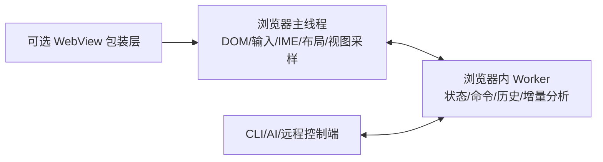

# MetaEditor 设计文档

MetaEditor 是一个基于 MoonBit 的编辑器开发框架（元编辑器）。它提供一套面向编辑器场景的底层运行时与工程基础设施，使开发者能够高效构建具有复杂交互、可持续演进、适合 AI 协作的软件编辑器系统。

## 1. 项目目标

- **响应式架构**：基于细粒度 Signal 机制，专为编辑器场景优化的响应式架构。
- **浏览器主运行时**：浏览器承载完整编辑器逻辑、视图与宿主状态，并直接暴露结构化接口给 CLI/AI。
- **UI 结构化验证**：允许 AI 直接对视觉属性（坐标、可见性等）进行结构化断言。
- **状态一致性**：强制 AI 使用带校验的 Patch 接口 (CAS 模型)，确保多人/人机协作下的状态安全。
- **时间序列动画**：将动画抽象为结构化的数值流，支持 AI 快速逻辑断言与投影端的高性能插值。

## 2. 系统架构

系统采用分层架构设计，确保核心逻辑与表现层解耦：

### 2.1 运行时分层 (Runtime Layers)

- **可选 WebView 包装层 (Optional WebView Shell)**：可选的系统容器，用于承载浏览器运行时，并提供少量原生能力入口。它不是必需层，也不持有编辑器主逻辑。
- **浏览器主线程 (Browser Main Thread)**：负责 DOM、输入事件、IME、焦点、滚动、布局测量、动画调度与视图采样，是浏览器宿主协调层。
- **浏览器内 Worker (Browser Worker)**：负责文档状态、命令执行、历史管理、增量分析等主要编辑器逻辑，是系统的逻辑内核。
- **结构化接口**：对 CLI、AI、自动化工具暴露稳定的命令、查询与几何/视图读取接口。

### 2.2 响应式与视图查询层 (Reactive & View Query)

- **响应式系统**：管理派生状态，驱动 UI 更新。
- **结构化视图查询**：为关键 UI 节点（光标、选区等）提供稳定的结构化几何与可见性读取能力，使视觉表现变得可观测、可审计。

### 2.3 状态与操作层 (State & Intent)

- **原子操作**：所有的数据操作都要通过特定的 op 来完成。
- **历史管理**：支持 Undo/Redo 栈与状态快照（Snapshots）。

### 2.4 浏览器真相与宿主瞬时状态

在当前路线下，系统不再以“无头 Core 持有最终视图真相”作为前提，而是把浏览器运行时视为 UI 真相所在。这个浏览器运行时内部又分为主线程与 worker 两层，需要明确区分的是：

- **语义真相 (Semantic Truth)**：主要由浏览器内 worker 持有，包含文档模型、业务状态、命令执行结果、历史状态以及大部分结构化查询结果。
- **宿主真相 (Host Truth)**：主要由浏览器主线程持有，包含布局测量、滚动、焦点、IME 会话、结构化几何结果以及其他依赖浏览器宿主环境的状态。
- **宿主瞬时状态 (Ephemeral Host State)**：浏览器主线程内那些只在运行期存在、且通常不需要序列化为文档状态的细节，例如 DOM 引用、事件上下文、临时组合输入会话等。

核心原则是：**CLI/AI 访问的是浏览器运行时通过消息接口暴露出来的结构化真相，而不是从外部黑盒猜测 UI。**

这意味着：

- 真相的位置从无头 Core 移到了浏览器运行时
- 浏览器运行时内部通过主线程与 worker 协作持有真相
- CLI/AI 直接和 worker 通信，通过结构化查询拿到 UI 真相
- 自动化测试仍然成立，而且拿到的是浏览器原生结果
- 浏览器不是被动投影器，而是系统主程序
- 整个系统统一采用消息传递，而不是依赖共享内存或跨层直接调用
- 如果未来需要多人协作或远程同步，它应作为浏览器运行时之上的一层能力，而不是当前运行模型的前提

因此：

- Browser Main Thread 负责宿主交互、布局测量与视图采样。
- Browser Worker 负责主要编辑器逻辑与语义状态。
- CLI/AI/脚本环境直接通过结构化接口连接 worker。
- AI 或测试验证 UI 时，应直接查询浏览器运行时暴露出的结构化结果，而不是依赖截图 OCR。

### 2.5 运行模型

系统采用“单一浏览器运行时 + 浏览器内 worker 内核 + 外部可连接控制端”的运行模型：

- **可选 WebView 包装层**：在桌面或移动端承载浏览器运行时，但并不是必须存在。
- **Browser Main Thread**：负责视图、宿主输入、布局测量、结构化几何采样与消息协调。
- **Browser Worker**：负责主要编辑器逻辑、状态更新、历史管理与大部分结构化查询。
- **CLI/远程控制端**：可以本地连接，也可以远程连接，直接与 worker 通信，通过结构化接口发送 command 并读取查询结果。涉及 DOM 的能力由 worker 再间接请求主线程完成。
- **消息传递**：主线程、worker、CLI 之间统一通过消息传递通信，使本地线程边界与未来远程边界使用同一种运行模型。

更新顺序统一为：

1. 浏览器主线程响应用户交互，处理宿主事件与测量结果。
2. 主线程通过消息把相关输入转发给 worker。
3. worker 执行命令，更新语义状态，并在需要访问 DOM 或宿主能力时向主线程发起请求。
4. 主线程执行对应的宿主操作，并把结果回传给 worker。
5. worker 汇总语义状态与宿主结果，对外向 CLI/AI/自动化工具返回结构化查询结果。

因此，系统最终不是“无头 Core + 被动投影层”，而是“浏览器运行时作为主宿主，内部 worker 作为逻辑内核，外部 CLI 作为可选控制端”。

### 2.6 编辑能力层 (Capability Layer)

- **编辑模型**：定义具体的编辑行为（如文本输入、多选、搜索）。
- **交互适配**：为 Web UI 和 CLI 提供统一的状态操作接口。
- **AI 接口**：面向 AI 代理的自动化操作支持。

## 3. 关键特性设计

### 3.1 UI 结构化验证

为了让 AI 检查 UI 渲染是否正确，框架在 VNode 定义中引入身份标识。

- **机制**：浏览器运行时维护一套结构化视图快照，记录关键节点的结构与几何属性。
- **应用**：AI 操作后，可直接查询 `query("cursor")` 的数值，无需依赖截图 OCR 即可发现渲染 Bug。

这里的“空间属性”直接来自浏览器运行时内部的结构化真相。CLI/AI 查询时拿到的是浏览器原生结果，而不是外部猜测。

### 3.2 时间序列动画 (Numerical Sequence Stream)

放弃直接使用不可控的 CSS 动画，采用“离散关键帧 + 局部插值”方案：

- **生成**：worker 生成描述动画路径的稀疏关键帧序列 `[(t, val, ease), ...]`。
- **验证**：AI 可以在 1ms 内扫描完整序列，验证动画逻辑（如终点偏移）的正确性。
- **渲染**：浏览器运行时接收序列并在本地进行 `RAF` 插值，保证视觉上的丝滑。

### 3.3 AI 与人类的差异化协作 (Intent Dispatcher)

- **UI 客户端**：受控环境，相信视图反馈，执行快速路径操作。
- **CLI/AI 客户端**：非受控环境，强制进行输入检查。AI 提交的 Patch 必须和其预期的旧内容匹配，否则 worker 将由于状态不同步而拒绝执行。

两者最终进入统一的操作栈，保证 Undo/Redo 的全局一致性。

## 4. 技术选型

- **开发语言**：MoonBit (利用其静态类型与高性能 Wasm 编译能力)。
- **运行环境**：浏览器主运行时 + 浏览器内 worker + 可选 WebView 包装层 + 可本地或远程连接的 CLI。
- **交互方式**：Web UI + 结构化命令与查询接口。
- **测试体系**：状态层单元测试 + 结构化几何断言 + 浏览器运行时自动化测试。

## 5. 风险与规避

- **动态特性迁移**：MoonBit 是静态类型语言，需要将原 JavaScript 版本中的动态机制重新设计为静态类型友好的响应式模型。
- **性能优化**：解析器在 MoonBit 下的执行效率需要通过实验进一步验证。
- **UI 验证**：通过可复现的示例场景和状态层深度测试来弥补复杂交互自动验证的不足。

## 6. 进阶

### 6.1 基于多人协作应用设计的混合人机编辑架构

这个设计的核心思想是将 AI AGENT 当作一个具有完整操作能力的用户，通过多人协作场景使用的 CRDT 等数据结构或算法来无冲突地合并人类操作与 AI 操作，示例：在文本编辑场景，我们使用这样一个 op 来描述所有的文本编辑操作：

> 输入一个文本范围和可选的一段文本，将文本范围内的文本替换为输入的文本，如果没有输入文本，则为单纯的删除操作。

要让这个操作可以适应人机协作的场景，我们需要让 AI 在决定写入的场景读取文件，获取一个编辑的文本范围，并且这个文本范围的 index 是 CRDT 里不变的数组索引，此时操作的文本范围就锁定了，AI 进入生成文本的过程，在此期间，人类用户或者其他 AI AGENT 仍然可以继续编辑文本。当文本生成结束，AI 使用之前获取的范围索引以及新文本提交操作，此时我们可以直接应用该操作，不过考虑到在文本生成的期间用户可能修改了目标范围内的文本，我们还可以做得更好，通过进行一次 diff 来确定哪些文本是在 AI 生成文本的期间修改的，我们可以把整个 patch 拆分为更小的一些分段，从而保证不破坏用户原有的编辑意图。

当然这个想法还是实验性的，也许 patch 这个编辑模型和保存用户编辑意图就是不兼容的，还需要更深入的思考。
