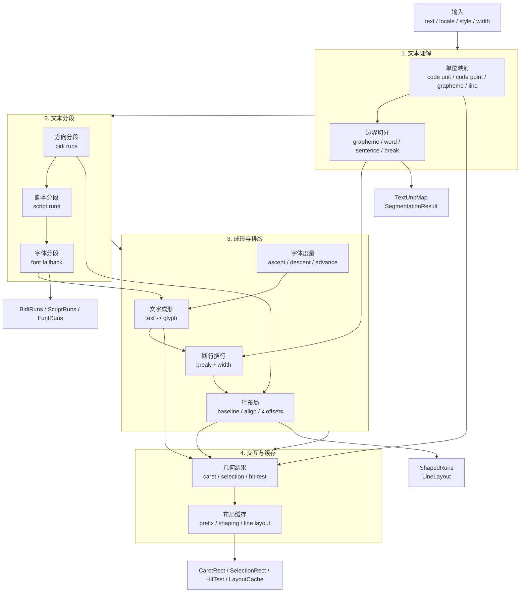

# MetaEditor 文本测量与文本布局技术栈分析

这份文档是 [design.md](/d:/Users/ch3co/Desktop/mbt_race/MetaEditor/doc/design.md) 的专题补充，专门分析文本测量与文本布局这一条技术线。它延续了前面对“逻辑层可测性”“浏览器 oracle”“关键布局上收”的讨论，但不重复整轮运行模型推导。

## 1. 为什么需要这份文档

MetaEditor 当前正在逼近一个更明确的方向：关键布局逻辑不能完全交给浏览器黑盒决定，至少编辑器核心区域的几何真相必须尽量提升到逻辑层，才能维持无头验证、AI 观察和结构化测试的能力。

文本区域是这个问题里最难的一块。普通按钮、侧栏、分栏容器的布局还可以通过一小套逻辑布局原语逐步收敛，但文本不是简单盒子。它从输入开始就要面对 Unicode、分词、换行、字体 fallback、shaping、bidi、命中测试、光标与选区几何等一整条链路。

如果这条链路完全依赖浏览器 DOM/CSS 的最终结果，那么：

- Core 无法持有足够完整的文本几何真相
- AI 很难直接对光标、选区、换行结果做结构化验证
- 多浏览器、多平台下的差异很难被清晰建模
- 逻辑层只能问浏览器“结果是什么”，而不能真正解释“为什么是这样”

因此，MetaEditor 在真正决定“文本布局要不要上收到逻辑层”之前，必须先把文本技术栈拆清楚：每一层到底在做什么、能买什么现成技术、哪些是巨坑、哪些值得逐步自研。

## 2. 需要解决的问题范围

这里讨论的不是“文本编辑器全部语义”，而是专门讨论**文本测量与文本布局**。

明确包含的问题：

- 文本输入是 Unicode 字符串，而不是简单字节流
- 同一段文本在不同字体、语言、书写方向、shaping 规则下，最终几何可能完全不同
- 编辑器需要的不只是“把文字画出来”，还包括：
  - caret 定位
  - selection rect
  - hit testing
  - wrapping
  - visual line mapping
  - scroll / viewport 协调
  - prefix width 查询
  - `(row, col) <-> (x, y)` 映射

明确不包含的问题：

- 语法高亮
- parser / incremental parsing
- undo / redo / patch 合并
- CRDT / 协作算法
- 一般 CSS block / flex / grid 布局
- 渲染后端原型代码

换句话说，这份文档真正要回答的是：

> 我们需要一条怎样的、可测试的、从 `text + font + style` 输入到几何输出的完整流水线。

## 3. 端到端流水线

### 3.1 总览

| 阶段 | 输入 | 处理内容 | 输出 |
| --- | --- | --- | --- |
| 1. 文本规范化与编码视图 | 原始字符串 | 建立不同文本单位的映射 | `TextUnitMap` |
| 2. Unicode segmentation | 字符串与 locale 偏好 | 切分 grapheme / word / sentence / break 候选 | `SegmentationResult` |
| 3. bidi 与 script/itemization | 文本与 locale | 建立方向 runs、script runs、shaping runs | `BidiRun[]` `ScriptRun[]` |
| 4. 字体选择与 fallback 决定 | runs、font-family 列表、平台字体 | 给每段文本选出实际字体实例 | `FontRun[]` |
| 5. 字体解析与基础 metrics | 字体文件或字体句柄 | 读取字体度量与 glyph 查询能力 | `FontMetrics` |
| 6. shaping | shaping runs、字体、script、dir | 产出 glyph、advance、cluster 映射 | `ShapedRun[]` |
| 7. line breaking / wrapping | shaped runs、宽度约束、break 候选 | 决定断行点与 visual rows | `LineLayout[]` |
| 8. 行布局与对齐 | line layouts、对齐策略、tab 规则 | 计算每行的 baseline、x 偏移与排布 | 行级几何布局 |
| 9. 几何产物生成 | 行布局与位置查询 | 生成 caret / selection / hit-test 等结果 | `CaretRect` `SelectionRect[]` `HitTestResult` |
| 10. 测量缓存与查询接口 | 前面各阶段结果 | 建缓存并暴露统一查询 API | `LayoutCache` |

### 3.2 1. 文本规范化与编码视图

**输入**

- 原始字符串
- 可能的换行策略
- 可选 locale 提示

**处理内容**

- 明确字符串在当前运行时中的底层编码视图
- 建立 code unit、code point、grapheme 索引之间的映射
- 切分逻辑行
- 决定是否进行 NFC / NFKC 等规范化

**输出**

- code unit 视图
- code point 视图
- grapheme 索引映射
- 行切分结果

**这个阶段对后续阶段的约束**

- 后续所有位置系统都必须统一依赖这里的索引映射
- 一旦这里没有定义清楚“用户语义位置”和“底层编码位置”的关系，后面 caret、selection、hit-test 都会漂
- 如果后面要支持 cluster 级命中测试，这里的映射必须可回溯

### 3.3 2. Unicode segmentation

**输入**

- 原始文本
- locale 偏好
- Unicode 数据

**处理内容**

- 按 grapheme cluster 切分
- 按 word / sentence 规则切分
- 生成 line break opportunities 的基础输入

**输出**

- grapheme boundaries
- word boundaries
- sentence boundaries
- line break opportunities 的基础输入

**这个阶段对后续阶段的约束**

- caret 左右移动、删除一个字符、按词跳转都要依赖这里
- line breaking 不应该自己重新发明 segmentation 规则
- 命中测试的合法落点也应当至少受 grapheme boundary 约束

### 3.4 3. bidi 与 script/itemization

**输入**

- 文本
- locale
- Unicode script / direction 数据

**处理内容**

- 识别 bidi runs
- 识别 script runs
- 识别 language / script / itemization 结果
- 建立真正送入 shaping 的 runs

**输出**

- `bidi runs`
- `script runs`
- `language/script/script-item segmentation`
- `shaping runs`

**这个阶段对后续阶段的约束**

- shaping 不是直接对整段文本做，而是对方向、script、语言和字体相对一致的 run 做
- 这一层决定了复杂脚本和混合方向文本能不能正确进入后续流程
- 如果这里偷懒，后面拿到的 glyph advance 再精确也没有意义

### 3.5 4. 字体选择与 fallback 决定

**输入**

- shaping runs
- `font-family` 列表
- 平台字体可用性
- 字体 fallback 规则

**处理内容**

- 决定每个 run 实际使用哪个 font face
- 处理某些字符在主字体缺字时的 fallback
- 产出稳定的 font instance key，供缓存使用

**输出**

- 每个 run 的 `font face`
- `fallback chain`
- `font instance key`

**这个阶段对后续阶段的约束**

- 没有稳定的字体选择结果，就不可能稳定测量
- fallback 一旦跨字体，glyph advance、baseline、line height 都可能变化
- 若要把文本测量提升为逻辑层真相，这一层必须是显式的，不能完全藏在浏览器里

### 3.6 5. 字体解析与基础 metrics

**输入**

- 字体文件、平台字体句柄或字体查询结果

**处理内容**

- 读取字体头信息
- 读取基础垂直度量
- 暴露 glyph metrics / cmap / unitsPerEm 查询能力

**输出**

- `unitsPerEm`
- `ascent/descent/lineGap`
- `baseline` 相关数据
- `glyph metrics` 查询能力

**这个阶段对后续阶段的约束**

- shaping 需要字体本体信息，不只是 CSS 字体字符串
- 行高、baseline、selection 高度至少部分依赖这里
- 如果这里不可靠，后面 layout 再精细也只是伪精度

### 3.7 6. shaping

**输入**

- shaping runs
- 实际字体
- script
- 方向
- 特性开关（ligature、kerning、variation 等）

**处理内容**

- 把文本转换成 glyph 序列
- 计算 cluster 对应关系
- 计算 glyph advance 与 offset

**输出**

- `glyph ids`
- `cluster map`
- `glyph advances`
- `glyph offsets`
- `run width`
- `logical-to-cluster mapping`

**这个阶段对后续阶段的约束**

- 这是文本几何里最关键的一层之一
- 没有 shaping，就没有真正可靠的宽度、cluster 边界、复杂脚本排版
- prefix width、caret 定位、hit-test 在复杂脚本中都离不开这层

### 3.8 7. line breaking / wrapping

**输入**

- shaped runs
- 可断点信息
- 宽度约束
- wrap 策略

**处理内容**

- 在 break candidates 中选择实际断点
- 建立 visual rows
- 决定每行包含哪些 glyph / run 片段

**输出**

- `break candidates`
- `chosen breakpoints`
- `visual rows / line boxes`
- 每行包含的 `runs/glyph range`

**这个阶段对后续阶段的约束**

- 没有这层就无法从单个 shaped run 进入编辑器真正需要的 visual rows
- selection rect 与 caret rect 必须落在 visual rows 上，而不是落在原始逻辑行上
- 这层和 `white-space`、`overflow-wrap`、`word-break`、locale line break 规则直接相关

### 3.9 8. 行布局与对齐

**输入**

- visual rows
- 对齐策略
- tab 规则
- baseline / line height 参数

**处理内容**

- 计算每行 top / bottom / baseline
- 计算每个 run 的 x 偏移
- 处理 tab expansion
- 处理简单 alignment

**输出**

- `line top/bottom`
- `baseline`
- `x offsets`
- `alignment` 结果
- `tab expansion` 后的位置

**这个阶段对后续阶段的约束**

- 到这里为止，文本还只是“带宽度的 runs”，还没有真正落在二维平面
- caret 与 selection rect 依赖的是排完版的行盒，而不是原始 run 宽度
- 这层是从“文本测量”过渡到“文本布局”的关键边界

### 3.10 9. 几何产物生成

**输入**

- 行布局
- 文本位置
- 查询点 `(x, y)`
- selection 范围

**处理内容**

- 生成 caret rect
- 生成 selection rect 列表
- 做 hit-test
- 建立 `(row, col) <-> (x, y)` 映射

**输出**

- `caret rect`
- `selection rect list`
- `hit-test result`
- `row/col <-> x/y` 映射
- `visible line extents`

**这个阶段对后续阶段的约束**

- 这是编辑器 UI 最直接消费的一层
- AI、Probe、自动测试真正要查的通常就是这里的产物
- 如果上游没有逻辑层真相，这里就只能继续问浏览器黑盒

### 3.11 10. 测量缓存与查询接口

**输入**

- 前面所有阶段的中间结果

**处理内容**

- 建立 prefix width cache
- 建立 shaped run cache
- 建立 line layout cache
- 暴露稳定查询接口

**输出**

- `prefix width cache`
- `shaped run cache`
- `line layout cache`
- 查询 API 形状

**这个阶段对后续阶段的约束**

- 如果没有缓存，文本测量系统会很快变成性能瓶颈
- 如果没有统一查询 API，上层组件会直接依赖底层库细节，后续很难替换实现
- 这层是后续逐步从浏览器黑盒切换到逻辑层真相的关键隔离层

## 4. 流水线总产物清单

| 对象 | 定义 |
| --- | --- |
| `TextUnitMap` | 维护 code unit、code point、grapheme、行列位置之间映射的基础对象 |
| `SegmentationResult` | 保存 grapheme / word / sentence / break candidates 的切分结果 |
| `BidiRun[]` | 按方向切分后的文本运行片段 |
| `ScriptRun[]` | 按 script / itemization 切分后的文本运行片段 |
| `FontRun[]` | 已经绑定实际字体实例与 fallback 结果的文本运行片段 |
| `FontMetrics` | 某个字体实例的基础垂直度量与 glyph 查询能力 |
| `ShapedRun[]` | 已经完成 shaping 的 glyph 运行结果，包含 advances、offsets、clusters |
| `LineLayout[]` | 完成断行与行排布后的 visual rows / line boxes 结果 |
| `CaretRect` | 某个文本位置在当前布局下对应的 caret 几何 |
| `SelectionRect[]` | 某个范围在当前布局下对应的一组矩形区域 |
| `HitTestResult` | 给定屏幕位置后命中的文本位置与附加信息 |
| `LayoutCache` | prefix、runs、line layout 等缓存对象的统一容器 |

## 5. 各阶段可用技术映射

### 5.1 Unicode segmentation

| 技术 | 负责什么 | 浏览器/Node 可用性 | 能否作为逻辑层真相 | 性能/体积/稳定性倾向 |
| --- | --- | --- | --- | --- |
| `Intl.Segmenter` | grapheme / word / sentence segmentation | 浏览器与较新 Node 可用 | 可作为过渡真相，不适合作为完全可控长期真相 | 体积零、接入简单、行为随引擎实现 |
| ICU | 完整 Unicode segmentation / break iterator 能力 | 需原生接入 | 可以 | 成熟、重、平台级 |
| ICU4X | segmentation 与数据裁剪能力 | 需 Rust/WASM/绑定 | 可以 | 比 ICU 更适合资源受限与自裁剪 |
| `unicode-segmenter` | JS 内的 grapheme 等切分 | 可直接用 | 可用于 v1 逻辑层实现 | 轻量、易接、覆盖面受实现约束 |
| `graphemer` | grapheme 切分 | 可直接用 | 仅适合 grapheme 层 | 稳定但偏旧，长期不宜承担整条 Unicode 栈 |

判断：

- `Intl.Segmenter` 很适合 v1 快速接入，但它仍然是引擎黑盒
- 如果目标是逻辑层真相，长期更应站在 ICU / ICU4X 族之上
- `unicode-segmenter` 这类库适合作为 JS 级 fallback 或中间阶段实现

### 5.2 line break / word break

| 技术 | 负责什么 | 适用位置 | 备注 |
| --- | --- | --- | --- |
| ICU break iterator | line break / word break / sentence break | 原生或高保真后端 | 成熟，适合长期真相 |
| ICU4X segmenter | grapheme / word / line break | Rust/WASM 方向 | 更适合可裁剪与嵌入式 |
| `linebreak` | JS 级 UAX #14 line breaking | 浏览器/Node 过渡层 | 适合 v1/v2，复杂 locale 行为仍有限 |
| 其他纯 JS 小库 | 基础 break 行为 | 实验或 fallback | 不建议作为主选型 |

判断：

- `linebreak` 是很现实的 JS 层过渡方案
- 真想把 break 规则纳入逻辑层真相，仍然应优先看 ICU / ICU4X

### 5.3 bidi

| 技术 | 负责什么 | 适用位置 | 备注 |
| --- | --- | --- | --- |
| ICU bidi | Unicode bidi 算法 | 原生高保真链路 | 成熟，适合长期真相 |
| ICU4X bidi | 新一代可裁剪 i18n 组件中的 bidi 能力演进 | Rust/WASM 方向 | 适合关注，但不能假定今天就覆盖 ICU 全面能力 |
| FriBidi | 专门的 bidi 实现 | 原生栈 | 成熟经典，常见于文本系统 |
| `bidi-js` | JS 级 bidi 处理 | 浏览器/Node 过渡层 | 可做实验与 v2 过渡，不宜过度乐观 |

判断：

- bidi 不是“小算法”，而是正经基础设施
- 如果 MetaEditor 明确暂不支持 RTL，可先不把它放进 v1 必选项
- 一旦决定支持阿拉伯语/希伯来语混排，最好直接引入成熟实现，不要自写

### 5.4 字体解析与 metrics

| 技术 | 负责什么 | 适用位置 | 备注 |
| --- | --- | --- | --- |
| 浏览器 canvas / `measureText` | 直接测字符串宽度，间接得到少量 metrics | 快速原型与浏览器 oracle | 易用但黑盒，很多细节不可控 |
| `fontkit` | 字体解析、字形与字体数据读取 | JS/Node/WASM 辅助链路 | 很适合做字体读取层 |
| `opentype.js` | 读取 OpenType 字体数据 | JS 级实验与轻量实现 | 可用，但长期完整性不如专业栈 |
| FreeType | 字体解析与 raster/metrics 基础设施 | 原生链路 | 成熟，适合长期底层 |
| Skia text / paragraph 栈 | 更高层文字系统中的字体和段落能力 | 参考上层集成 | 不是细粒度可控逻辑层的直接替代 |

判断：

- `measureText` 非常适合当第一阶段真值来源和对照系
- 但它不是长期可控的字体度量基础层
- 长期应区分“字体解析/metrics”与“最终浏览器黑盒测量”

### 5.5 shaping

| 技术 | 负责什么 | 适用位置 | 备注 |
| --- | --- | --- | --- |
| HarfBuzz | 核心 shaping 引擎 | 原生长期真相 | 事实标准之一 |
| `harfbuzzjs` | HarfBuzz 的 JS/WASM 绑定 | 浏览器/Node/WASM 过渡到长期链路 | 非常关键，是真正值得认真考虑的桥梁 |
| 浏览器原生 shaping | 浏览器内部做 shaping，但只通过 canvas / DOM 间接暴露 | oracle 或黑盒依赖 | 能用结果，拿不到清晰中间产物 |
| Pango / Skia text shaping | 上层文本系统里的 shaping 能力 | 高层集成参考 | 适合整段接入，不适合细粒度自控流水线 |

判断：

- shaping 是这条流水线里最不该自己从零实现的一层
- 一旦目标不是“永远停留在浏览器黑盒”，长期几乎必然要落到 HarfBuzz 家族

### 5.6 更高层文本布局系统

| 技术 | 负责什么 | 适用位置 | 备注 |
| --- | --- | --- | --- |
| Pango | 高层文本布局系统 | Linux / 原生富文本环境 | 很强，但集成后可控粒度下降 |
| Skia Paragraph | 高层段落布局 | Skia 生态 | 适合整段文本布局，不一定适合作为 MetaEditor 核心内部真相 |
| Qt text stack | 完整文本排版与 UI 体系 | Qt 生态 | 参考价值大，迁移成本也大 |
| 浏览器内建 layout / shaping | 全栈黑盒真相 | 作为 oracle 或临时实现 | 不适合作为长期唯一真相 |
| 自己基于 ICU + HarfBuzz + FreeType 组装 | 自己掌控核心文本流水线 | MetaEditor 逻辑层长期路线 | 成本高，但最符合“可测性与可控性”目标 |

### 5.7 小结论

| 阶段 | 推荐首选技术 | 可接受替代 | 不建议作为长期真相的技术 |
| --- | --- | --- | --- |
| segmentation | ICU / ICU4X | `Intl.Segmenter` `unicode-segmenter` | 自写 Unicode 规则 |
| line break | ICU break iterator / ICU4X | `linebreak` | 手写局部断行规则当长期方案 |
| bidi | ICU bidi / FriBidi | `bidi-js` | 自写 bidi |
| 字体解析与 metrics | FreeType / `fontkit` | `measureText` `opentype.js` | 永久只依赖浏览器黑盒 metrics |
| shaping | HarfBuzz / `harfbuzzjs` | 浏览器黑盒 | 自写 shaping |
| 高层段落布局 | 视需求选 Skia Paragraph / Pango / 自组装 | 浏览器黑盒段落布局 | 把浏览器黑盒直接当逻辑层真相 |

### 5.8 文本处理流水线

## 6. MetaEditor 如果完全自己做，各阶段代价如何

### 6.1 总体判断

这里的“自己做”指的是：不依赖成熟实现，自己写出在行为上等效的替代。估算不追求精确排期，只给出量级、难度和主要风险。

必须强调两件事：

- “能在简单样例跑通”与“足够成为平台真相”不是一个等级
- Playwright 只能帮验证，不会显著降低 shaping / bidi / line-breaking 的实现本体难度

### 6.2 代价表

| 阶段 | v1 可用子集 | 接近浏览器成熟行为 | 难度 | 最大风险 | 最容易低估的点 |
| --- | --- | --- | --- | --- | --- |
| 文本规范化与基础索引映射 | `1-3 天` | `1-3 周` | 低 | 位置系统定义不统一 | code unit / code point / grapheme 映射回写 |
| grapheme segmentation 等效替代 | `1-3 周` | `2-6 月` | 中到高 | Unicode 边界规则不完整 | emoji、ZWJ、组合字符 |
| line break 等效替代 | `3-8 周` | `6 月以上` | 高 | locale 相关断行行为很快失控 | CJK 与空格语言混合行为 |
| bidi 等效替代 | `2-6 月` | `6 月以上` | 很高 | 逻辑顺序与视觉顺序转换错误 | 光标移动与 hit-test 的方向映射 |
| 字体解析等效替代 | `1-3 月` | `6 月以上` | 很高 | 字体格式与 metrics 细节过多 | fallback、variation、font collection |
| shaping 等效替代 | `6 月以上` | `无法保守估计` | 极高 | 复杂脚本几乎必炸 | cluster、ligature、kerning、脚本特性 |
| 完整多脚本文本布局等效替代 | `6 月以上` | `无法保守估计` | 极高 | 上游每层误差叠加 | 不是单一算法，而是整栈系统工程 |

### 6.3 分阶段说明

#### 文本规范化与基础索引映射

- 这是整条链里最容易自研的一层
- 难点不在算法，而在定义要不要规范化，以及后续所有位置系统是否都统一引用
- 如果这里只做一版干净的 `TextUnitMap`，成本可控

#### grapheme segmentation

- 只支持常见 Latin/CJK 样例时，看上去并不难
- 一旦要接近 Unicode 完整行为，复杂度会显著上升
- 这里最容易让人误判：“分字符”看起来很简单，实际上 grapheme cluster 规则并不简单

#### line break

- 这层比很多人直觉里更难
- 简单版可以“按 grapheme 前缀宽度二分 + 碰到空格优先断”
- 但一旦进入 CJK、禁则、软换行、locale 规则，难度迅速抬升

#### bidi

- 这层不适合以“之后补一下”来想象
- 只要支持 RTL，它就会影响：
  - shaping runs
  - visual order
  - caret 映射
  - hit-test
- 所以要么 v1 明确不支持，要么直接引成熟库

#### 字体解析

- 这里不是简单“读个 TTF 文件”就完事
- 真正难的是和 shaping、fallback、metrics、variation、字体集合一起工作
- 如果只是为了做 v1 原型，可以借浏览器和 `fontkit`
- 如果要长期掌控文本真相，迟早要站在更成熟字体底座之上

#### shaping

- 这是整条链里最不应该轻视的部分
- “把字符映射成 glyph”只是表层，真正麻烦的是：
  - cluster
  - glyph advance / offset
  - script-specific shaping rules
  - OpenType feature interaction
- 如果没有 HarfBuzz 级别的东西，长期很难严肃支持复杂脚本

#### 完整多脚本文本布局

- 这不是一个单点算法，而是一整条系统工程
- 从 segmentation 到 shaping 再到 line layout，每层都可能把误差向后放大
- 因此如果真的走到这一步，MetaEditor 实际上是在建设一套文本平台，而不是只写几个测量函数

## 7. Playwright / 浏览器 oracle 的作用与边界

### 7.1 它能做什么

- 把浏览器当作黑盒真值来源
- 自动生成回归样例
- 对比不同字体、脚本、宽度条件下的测量结果
- 验证 caret / selection / hit-test 行为
- 帮助建立 conformance suite

### 7.2 它不能做什么

- 不能替代规则建模
- 不能自动产出一套可维护的算法
- 不能显著降低 shaping / bidi / line-breaking 的实现难度
- 不能把浏览器历史兼容规则变简单

### 7.3 正确定位

- 浏览器是 **oracle**，不是实现本体
- 它适合做：
  - 真值采样
  - 回归对照
  - 差异发现
- 它不适合做：
  - 逻辑层长期唯一真相来源
  - 对内部中间产物的清晰解释器

更直接地说，Playwright 能帮助 MetaEditor 逐步逼近浏览器行为，但不能把“做一个文本布局系统”这个问题自动简化成“抄浏览器输出”。

## 8. 对 MetaEditor 的建议路线

### 阶段 A：先跑通编辑器核心测量闭环

建议技术：

- `Intl.Segmenter` / ICU family
- 浏览器 `measureText`
- 基础 prefix cache
- 基础 wrap / caret / selection / hit-test

目标：

- 先支持 `LTR + Latin/CJK`
- 暂不把复杂脚本完整支持作为 v1 目标
- 先把：
  - 查询 API
  - 位置系统
  - 几何产物模型
  定下来

这一阶段的重点不是立刻脱离浏览器，而是先把“文本测量系统的接口与产物”钉住。

### 阶段 B：把底层真相从浏览器黑盒逐步替换

建议技术：

- HarfBuzz / `harfbuzzjs`
- `fontkit` / FreeType 级字体度量来源
- line break / bidi 引入成熟库
- 保留 Playwright 对照验证

目标：

- 让核心文本测量逐步脱离 DOM / canvas 黑盒
- 提高逻辑层可测试性
- 提高跨环境一致性
- 开始显式持有更多中间产物，而不只是最终宽度

### 阶段 C：决定是否上完整 i18n 文本平台

这是战略问题，不是短期必须项。要不要走到这一阶段，应当由下面几个条件决定：

- 是否必须支持 RTL
- 是否必须支持复杂 Indic / Arabic shaping
- 是否要把文本布局作为跨平台核心基础设施
- 是否接受长期维护 ICU / HarfBuzz / 字体数据这类底层依赖

如果答案是“是”，那 MetaEditor 最终就不只是“借一点浏览器文本能力”，而是在建设自己的文本平台。

## 9. 推荐的初始选型结论

- **不建议** 自研 Unicode segmentation / bidi / shaping 规则
- **建议** 直接站在 ICU / ICU4X / HarfBuzz / 成熟字体库之上
- **建议** 先把文本测量 API 设计出来，再决定底层逐层替换
- **建议** 把浏览器测量结果用于验证集，而不是长期唯一真相来源
- **建议** MetaEditor v1 明确收窄到 `LTR + Latin/CJK + 基础换行 + 基础命中测试`

更具体地说：

- segmentation 层：优先站在 ICU 家族之上
- shaping 层：长期应以 HarfBuzz 家族为核心
- 字体层：不要把浏览器 `measureText` 误当成完整字体度量系统
- 验证层：浏览器仍然非常重要，但应该扮演 oracle，而不是最终架构归宿

## 10. 附：MetaEditor 最小文本测量 API 草案

下面这组 API 不是实现方案，只是用来收束上面的流水线，给后续工程接口一个最小目标形状。

| API | 说明 |
| --- | --- |
| `segment_graphemes(text)` | 返回 grapheme 边界与相关索引映射 |
| `segment_words(text, locale?)` | 返回 word 边界结果 |
| `break_lines(text, style, width)` | 在给定样式与宽度下计算断行结果 |
| `shape_run(text, font, script, dir)` | 对单个 shaping run 执行 shaping |
| `measure_run(run)` | 返回某个 shaped run 的宽度与关键 metrics |
| `layout_paragraph(text, style, width)` | 对整段文本完成 line layout，生成可查询布局对象 |
| `caret_rect(layout, pos)` | 查询某个文本位置的 caret 几何 |
| `selection_rects(layout, range)` | 查询某个范围的 selection rect 列表 |
| `hit_test(layout, x, y)` | 根据屏幕坐标命中文本位置 |

这组 API 的意义不在于“最终一定长这样”，而在于提醒 MetaEditor：真正需要的是一层可替换、可缓存、可测试的文本测量接口，而不是散落在组件里的若干 `measureText` 调用。
